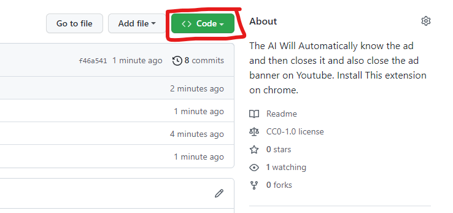
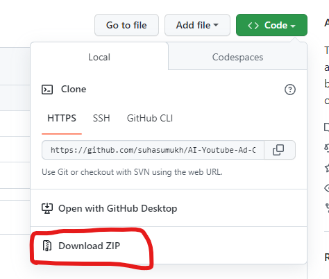
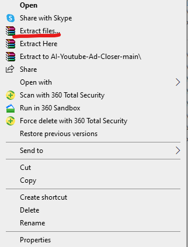
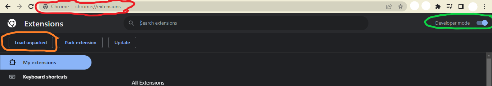

# YouTube Ad Closer
This extention will automatically know when the ad pops and then it skips it and also closes the ad banner on Youtube. Install This extension on chrome.
Enjoy Ad Free Youtube with this extension!!!

### Content
- [Install](#how-to-install-the-extension-step-by-step-method) 

  

# How to Install the extension step by step method:
 
Step 1 --> Click on <>Code on github.
 

 
Step 2 --> Download the ZIP file.
 

 
Step 3 --> Go to file explorer and extract the zip file & copy all the file and make your own new folder and paste the file in it (Note:- All copied file must be pasted into the newly made folders only.)
 

 
Step 4 --> Open Google Chrome and go to [chrome](chrome://extensions/). Click on Developer Mode on the right top corner of the extensions page and toggle on the button. Click on Load unpacked and upload the folder you have saved all the source file.
 
     
 
 
Step 8 --> You have succesfully installed the Youtube ad closer extension.
 
Enjoy ad free experience with this extension.  
